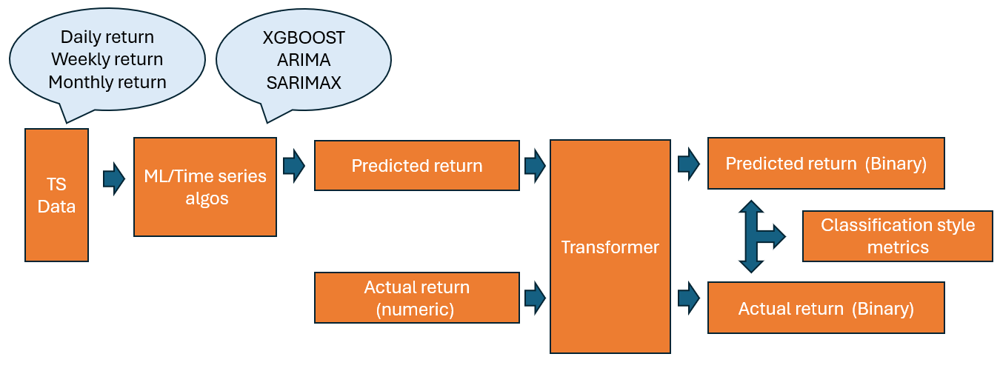
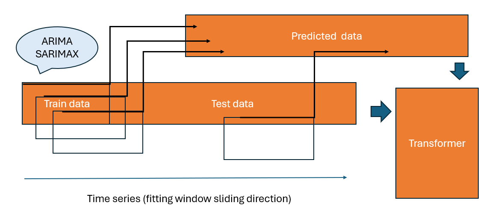
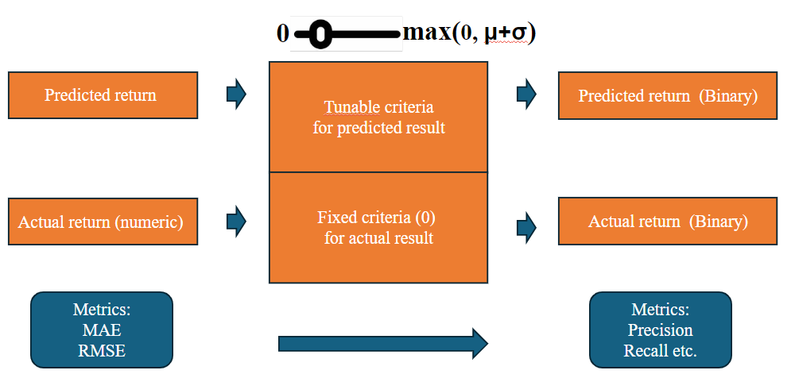

------------------------------------------------------------------------------

## Project Title 
Stock Price Trend Forecasting With Stats/ML algos and the related trading stragety
=========================

## Project overview 

The objective of this project is to reliably predict stock price returns using historical time series data available online. This involves employing a combination of statistical methods and machine learning regression models to achieve accurate predictions. The predicted result will be utilized to generate the trading signal and test the performance in the real situation. To explain the problem in a most straightforward way: By running the system with all the data available today, we predicted that five days later the stock price will increase. Since we trust the model and we decided to buy several shares. According to the model, it is highly possible that if we sell the stock that we bought today, we will make money. 

By deploying our backtesting system in the end of Notebook6, we will be able to see if we keep investing with this system, how will the capital change. 

## Methodology
### 1. Data Collection and Preprocessing
Sources: Fetch historical stock price data from APIs such as Yahoo Finance.
Time Frame: Collect data spanning multiple years to capture various market conditions and the data granularity is daily.

### 2. Feature Engineering:
Create new features such as moving averages and other technical indicators.
Lagged features to incorporate past values into the prediction model for XGBOOST.
Generate the return in different time scale: Daily return, Weekly return and Monthly return. I realized that it is difficult to precicely predict the return of the apple stock as it is very stoichastic. Apart from that, to connect the idea more closely to the real life situation, it is more clever to consider how to precisely pick up the large positive return. 

### 3.Exploratory Data Analysis (EDA)
Visualization:
Plot stock price trends over time and check the decomposition result.
Visualize moving averages, trading volumes, and other indicators.

Statistical Analysis:
Perform descriptive statistics to summarize data characteristics.
Analyze distributions, seasonality, and autocorrelation of stock prices.

#### 3. Modeling

Statistical Models:
ARIMA (AutoRegressive Integrated Moving Average): Model for univariate time series data predicting future points.
SARIMA (Seasonal ARIMA): Extension of ARIMA for handling seasonality in data. Potential Exogerous terms: Volume change.

Machine Learning Models:
XGBoost: Ensemble learning method to predict the next day return.

The more detailed working flow in modelling will be viewed below: 

In the figure, we can see that we utilized a novel prediction method. Firstlty, we used a continuous trainning method to keep our models updated. Secondly, we used a fitting window with fixed length. The performance of this new method is compared with the traditional method: fitting on all the available time range and the results are shown in the Notebook6. 

The predicted result is then fed to the binary transformer. We can thus use the classification style metrics to evaluate the models. 

#### 4. Model Evaluation and Selection

Performance Metrics:
Precision: The ratio of the correctly predicted positive return days among all the predicted positive days.
Recall: The ratio of the 

Model Selection:
Compare models based on evaluation metrics.
Select the best-performing model or ensemble of models for deployment.

#### 5. Dataset

AAPL stock data from yfinance api from 2010 to 2024. 

Data introduction:

Open 
High 
Low
Close
Adj Close 
Volume 

Added feature:
1-day return 
5-day return 
1-Month return 
Trading volume change (weekly)

#### 6. Adv and disadv

Advantage:
1. This system can potentially be deployed on different stocks and different time scale. This is because the countinuous trainning process get rid of the possibility of introducing large bias.
2. This time series analysis system is very similiar to the real-life situation as we prevent the data leakage very well.
3. Good interpretability
4. Highly comprehensive(including the idea of regression and classification together)

Disadvantage:
1. This system will need a long time for running because every time we need to retrain the models for multiple times
2. Potential overfitting problem

------------------------------------------------------------------------------